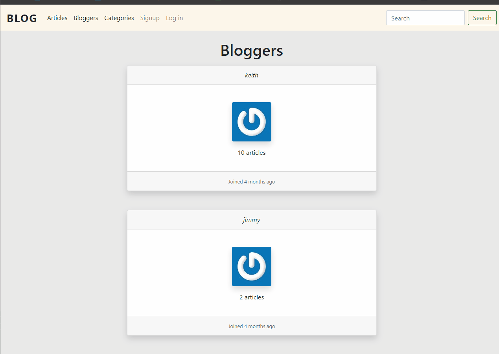

# Blog

A simple blog similar to the blog tutorial from Ruby Guides. Write articles and tag certain genres. View articles that others have written.

# Features:
* Login/signup flow with e-mail address
* Create and edit articles
* Categories
* Secure password with bcrypt

# Tech Stack Used:
* Ruby 2.6.6
* Rails 6
* Bootstrap
* https://keith-blog.herokuapp.com/

Local Installation:
* clone repo
* $ bundle install
* $ rails server

